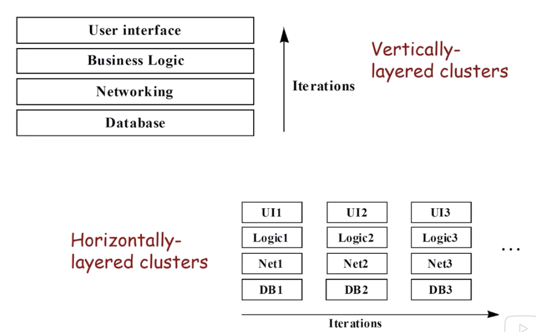

# **SOFTWARE DEV – Agile**

From Agile course on eDX

## Pre Agile Model

Waterfall model

- Goes from Requirements  Analysis to Coding  Testing
- Drawbacks: late appearance of code, linearity, lack of acceptance of change

## Agile Manifesto

12 better ways of developing software written by consultants in 2001

​	**Individuals** over processes (no micromanagement of teams, let developers be, provide support, face to face conversation)

​	Working **software** over documentation

​	**Customer** collaboration over contract negotiation (continually talk to customers)

​	**Agility** (change) over following plans

## Agile Methodologies

​	1	**Extreme Programming** (oldest) – said only thing that matters is developers, not documentation, not plans, etc.

​			Humanity – safety, belonging, growth, etc.

​	2	**Lean** – brings Six Sigma lean practices to programming – getting rid of “waste”

​			Amplify learning process – try different types of code

​			Make decisions as late as possible

​			Deliver as fast as possible

​	3	**Crystal** – color based management

​			Focus on one task at a time; 2-hour no interruption period

​			Personal safety – build trust in team, do not make fun

​	4	**Scrum** (most common today) – management methods like Sprints (short term pushes) small “naturally forming” teams, etc.

**Testing** plays a major role in Agile methodologies

## Agile **Values** (philosophical) and **[principles, roles, practices, artifacts]** – these are more practical

**Values** – general philosophy of Agile development

​	**Manager role** is reduced – do not assign tasks

​	No **Big Upfront** steps – no defining requirements, etc. Just get into it!

​	**Iterative** development – aka “sprints” (“Agility”)

​	Defined **scope** – limit feature creep/waste (“Customer collaboration”)

​	**Testing** (regression testing)

**Principles** – organizational and technical in nature

​	Organizational:

​		**Customer**

​			XP : you should bring customer into your own team

​			Scrum : “Product Owner” decides if each dev cycle is acceptable

​		**Change** - Object oriented programming, e.g., is one way to implement change

​		**Team**

​			Manager doesn’t assign tasks

​			Manager encourages, catches errors, provides support, team spirit, etc.

​			Team talk to customer themselves, no manager needed

​		**Pace**

​			No more than 40 h/wk (lots of time off)

​		**Minimal Software**

​			YAGNI – You ain’t gonna need it – many features aren’t useful!

​			Prevent **waste** – extra features, handoffs, unreleased work, etc.

​			Reject any intermediate product

​	Technical:

​		**Iterative** development (**sprint** in scrum terminology)

​		Each cycle should produce working system (horizontally layered)

	

​		2- to 6-week cycle

​		**Closed Window Rule** – freeze requirements during iteration

**Testing**

​	Test first!!

​	DO NOT MOVE ON until all tests pass

​	**Regression Tests** – essential tests that have failed once before

Scenarios (**User Story**)

​	Requirements for project in Agile world – what user wants

​	“As a ___ I want to ___ so that ___”

​	

## **Roles**

**Traditional** Managerial Roles:	

	
 Scrum has three roles

​	1 **Team**

​		5-9 members, cross functional (broad specialties), self organizing and defines goals for iteration

​		Divided into **pigs (committed)** and **chickens (not so involved)** in meetings, only pigs can talk

​	2 **Product Owner**

​		defines product features, release date, ROI, prioritization

​		accept/reject results

​	3 **Scrum Master**

​		ensures Scrum is implemented properly, remove impediments coordinate meetings, protect team from management

Other Agile Roles

​	**Expert User** (from Crystal) – a USER who talks to team to provide help

​	**Customer** (XP) – meet with team to clarify user stories, etc.

​	**Developer** (XP) – turn user stories into code

​	**Tracker** (XP) – keep track of schedule, ensure timelines

​	**Coach** (XP) – mentor, lead, guide, or even do something when needed

## **Practices**

**Meetings**

​	**Daily Meeting** (every morning, set day's work, short [15 min], quick discussions)

​	Key Questions: (1) What did you do yesterday (2) what today (3) what impediments?	

​	Scrum also has **Planning Meeting** (define goal for sprint), **Retrospective Meeting** (after sprint)

​	**Review Meeting** (share work with customers)

**Development**

​	**Pair Programming** – (compare with code reviews)

​	**Single Code Base** – no branching allowed

​	**Shared Code –** everyone can change every part of the code (no “ownership”)

​	**Optimize at End** – don't try to solve problems that don't exist yet

​	**Simple** and **Incremental Design** – produce simple code, then refactor, then add complexity

​	**Refactoring** – change code internally without changing external behavior

**Release**

​	Ideally build daily or more frequent; a release cycle should be 1 week

​	**Continuous Integration** – integrate latest code and tests several times a day

**Testing**

​	Agile loves testing compared to specifications (in traditional software development)

​	**Coding Standards** – all code written with same style, etc.

​	**Unit Test –** always write code with unit tests. All tests must pass before moving on.

​		XP even says write test before coding (test-first development)

​	**Regression Test Suite** – tests that failed earlier

​	**Bugs** – bugs are not a bad thing, they are a test that wasnt written

​		Write a test, add it to regression suite

​		**Root Cause Analysis** – why did a bug arise in the first place?

​	**Acceptance Test** – a test on a broader scale designed by customer 

​		

**Management**

​	**Scrum of Scrums** – for scaling Agile projects, adds additional meeting for team leads

​	**Whole Team** – all contributors sit together.

​	**Open workspace** – emphasizes communication, lots of whiteboards, overhear conversations.

​	**Informative Workspace** – story board, burndown chart, release charts

​	Meet all **technical needs** – don't limit team with tech limitations

​	**Customer always available** – help write user stories, release timing, etc.

## Artifacts

Agile loves user stories compared to requirements (in traditional software development)

| User Story                                                   | Use Case                                                     |
| ------------------------------------------------------------ | ------------------------------------------------------------ |
| defines an atom of functionality exemplified as **story card** | how to achieve a task through interactions between users and system |
| simple                                                       | Complex                                                      |
| Written by customer (therefore incomplete)                   | Written by dev                                               |
| For common case (no exceptional cases)                       | For all cases                                                |

**Product Backlog** – contains backlog of all potential features ordered by business value, and includes how much development effort is required for that feature; created by product owner. Exemplified as **task board**:

​			Story	To Do		In Process	To Verify		Completed

**Velocity** – plotted as tasks remaining divided by time remaining in project

Exemplified as **burndown chart**