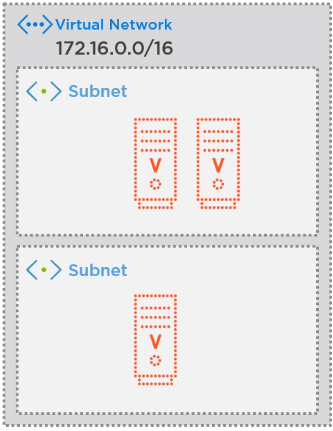

# Microsoft Azure Services & Concepts (Core Azure Services)

There are four classes of services: **compute, network, storage/databases** and **platform solutions**.

## Azure Marketplace

A key offering is **Azure Marketplace**. This has a solution catalog of 8,000 listings that can be quickly leveraged for building a solution. This includes things like SAP, WordPress and others, all of which are certified for Azure.

## Azure  Compute

Azure Compute is a set of services for on-demand, pay-per-use computations. Generally, these are pay per use, easy to provision and highly available.

- **Virtual Machines** - software emulations of physical computers
- **Containers** - running Docker containers
- **Azure App Service** (PaaS offering) - hosting for web apps, API apps and mobile apps or hosting containers
- **Serverless Computing** - no underlying infrastructure

### Virtual Machines

**Azure Virtual Machines** is an IaaS providing full control over the operating system, but requires updating OS, installing software. VMs are pay-as-you-go and are familiar to administrate for admins. When creating you must provide:

- Image (the OS - Windows or Linux)
- Size of VM (RAM and storage)
- Availability (whether to use an **availability zone**)

Microsoft Marketplace offers a bunch of images that come with software preinstalled (things like SQL, Visual Studio, ArcGIS, etc.).

A **Virtual Machine Scale Set** will create a bunch of identical VMs that can auto-scale and provide redundancy.

**Azure Batch** is another VM management tool designed for big data jobs. It provisions, installs and runs compute VMs, and then scales down the pool.

### Containers

Unlike VMs which have a host OS with a **HyperV** (hypervisor) and a guest OS, containers virtualize the OS (such as Docker) thus making them lightweight. So, multiple operating systems can be emulated on a single computer.

> VMs virtualize the hardware and containers virtualize the OS.

**Azure Container Registry** is a listing of container images (these images tell you how to create a container from an image), akin to DockerHub.

**Azure Container Instances** is a PaaS offering for easy deployment for simple containers, with limited control over orchestration, security, insight, etc.

**Azure Kubernetes Service** is a container management system (**orchestration**) that can allow scaling for bigger applications, which is managed. **Pods** are a group of containers sharing resources. **Nodes** are virtual machines (host) for the pods. Azure Kubernetes Service can work with **VM Scale Sets** to auto scale the underlying VMs, as well.

### Azure App Service

**Azure App Service** is a PaaS for hosting (like traditional web hosting). Azure handles the OS and security. You can host:

- Web Apps
- Mobile Apps
- API backend apps

Originally called **Azure Websites**, hence the default URL. Requires an **App Service Plan**, which defines the pricing tier of underlying VMs (CPU, RAM, OS, region) - there is auto-scaling available, also.

App Service adds features for websites, such as ENV_VARs, authentication, state management, default document and deployment slots (for dev and prod types). AppService also has a Zip Uploader for files, Container hosting and Console access for underlying VM. 

### Serverless

There are three main types of serverless apps:

- **Azure Functions** - trigger-activated and fully managed, these run code on demand. They auto-scale and are best for short compute tasks. Functions can be stateless or **Durable Functions** which remember previous state
- **Azure Logic Apps** - design workflows. Logic Apps can call functions and other connectors. Logic Apps are stateful for the life of a request.

Triggers include: time of day, HTTP webhook, events, queues

## Azure Networking

Networking products allow creating secure networks for internal Azure resources, as well as hybrid cloud setups.

**Azure Virtual Network** (**VNET**) is the core unit for networking and links various Azure services together. Resources can be VMs, Redis Cache, app service, etc. and each has its own IP address.

- **Isolation** - VNETs are isolated from the outside world and have **subnets** with an IP range
- **Inter-Resource Communication** - Azure resources in a VNET can communicate securely with each other.
- **On-Premises Communication** or **Hybrid Cloud**- there are three ways to link on premises network using a **virtual private network** (VPN):
  1) **Point to Site VPNs** - client computer connects to Azure securely
  2) **Site to Site VPNs** - a device connects to Azure from the on premises network
  3) **Azure ExpressRoute** (also site to site) - routes traffic thru third party providers (e.g. AT&T/Verizon) and validates traffic between Azure and on-premises network. The key is that it is *completely private* but also unencrypted. Offers redundant connectivity
- **Route Network Traffic** - Route Tables define routing rules for traffic. A Border Gateway Protocol (BGP) propagates traffic rules from on-premises to Azure  
- **Filter Network Traffic** - Network Security Groups can be defined to control the security in a network

By default, devices in a virtual network cannot communicate with devices in another virtual network, and they can't be reached from the internet. Can enable **Vutual Network Peering** to allow talking to another VNet. 

**Azure Application Gateway** is a load balancer for public apps. It handles encryption, web app firewall, auto scaling, session affinity (for routing requests to one server after initial session started).

**Network Security Groups** provide simple protection for a subnet - act as simple firewalls. **Azure Firewall** is a more robust firewall.

## Azure CDN

Azure provides a CDN for minimizing latency, and offloading traffic from source servers (called **origin servers**). Typically this is for static data (JS, HTML, CSS, Word document, etc.). **Edge Servers** are CDN servers that serve up data.

**Azure CDN** can connect to App Service, Blob Storage and others to cache content, in addition to any public content. Each type of content can be configured to have different expiry policy, etc.

**Dynamic Acceleration (DSA)** is designed for optimizing dynamic data. DSA does this by:

- optimizing for the shortest path in the worldwide network
- Compressing images on demand for mobile devices
- Sending HTML and images at the same time

## Data Storage in Azure

There are shared benefits to using Azure storage: replication across the world, encryption and automated backup and recovery. There are three classes of data:

1. **Relational data** (structured data): Azure SQL Database / Azure Database for MySQL / Azure Database for PostgreSQL
2. **Unstructured Data** (blob data): Azure Blob Storage, Azure File Storage, Azure Disk Storage
3. **Semi-Structured Data** (NoSQL data, uses key/value pair): Cosmos DB 

### Relational Data

There are 3 models for relational database storage:

1. **Azure SQL Database** is the flagship PaaS offering where MS handles update, patch, backup, and infrastructure and runs Microsoft SQL Server. Pricing is based on either cores of CPU or **DTU** (**Database Transaction Units**). You have limited control of the underlying VM. Updates to SQL Server come to Azure SQL Database first.
3. **Azure SQL Managed Instance** is a service that brings the benefits of PaaS - fully managed by MS - while adding some more options for the underlying database engine: character encoding, manual backups, Common Language Runtime access, cross-database views, etc.
3. **Azure Database for MySQL or PostgreSQL** is a cheaper offering. This gives SQL community edition and pay-as-you-go pricing, with decent uptime, scalability and automatic backups.
   PostgreSQL is available as **single server** and **hyperscale (Citus)** for deployment. Single server is offered at three pricing tiers and allows vertical scaling. Hyperscale is a sharded option over multiple machines, and distributes work automatically.

### Unstructured Data

**Azure Storage Accounts** allow storing unstructured data:

- **Blob Storage** ("Binary Large Object" storage) - a basic storage for key value pairs or objects. **Block Blobs** store chunks for data like binary files. **Append Blocks** are good for logs and **Page Blobs** are good for frequent read/write operations.
  Use cases: images, audio/video, archiving, data needed for analysis
- **File Storage** - file shares that support *SMB*. This is good for applications that need file access from disk, as the file storage can be mounted. Supports concurrent mounting by many clients.
- **Disk Storage** - IaaS disk storage used by virtual machines

Data is stored three times in a data center for Azure Storage, and if available, you can copy across an availability zone, or across regions. Data is available using:

- HTTPS REST endpoints using Role Based Access Control
- SDKs for many languages
- PowerShell
- Azure CLI

For authentication, we have:

- **Storage Account Key** (see all data in a storage account)
- **Shared Access Signature** tokens (this is a time-limited key that can be very specifically scoped to a specific service/folder, or the type of access like reading)

For **blob storage**, there are three access tiers: **Hot Tier**, **Cool Tier** (30 days of storage) and **Archive Tier** (180 days of storage) that are differ in cost and access needs. Access tiers exist to make Azure data storage cheaper based on access patterns. Archive tier costs money to rehydrate when needed.

### Semi-Structured Data

**CosmosDB** is a globally distributed, millisecond-response time, multi-model database. CosmosDB has a loosely typed schema.

Scales throughput and storage across Azure regions elastically, and is backed by SSD storage. Data is stored in **ARS (Atom, Record, Sequence)** format.

For querying data, SQL, MongoDB, Azure Table Storage, Gremlin, etc. API models are all supported and must be given at table creation time.

**Consistency Models** range from strong to eventual with three other levels. The different models trade off latency and/or availability. 

### Migration Options

**Azure Database Migration Service** migrates from on-premises or cloud databases into Azure. Databases can be assessed using a tool from Microsoft - **Data Migration Assistant** to determine if it is compatible with the target.

## Azure Platform Solutions (IoT, Big Data and ML)

### Internet of Things

Refers to devices and sensors connected to the internet, which can generate insights and provide alerts. Azure offers three tools:

1. **Azure IoT Central** - Managed app platform (PaaS) that allows quick prototyping with IoT. Comes with pre-built templates for industries' common problems and common IoT devices.
2. **Azure IoT Hub** - more of a lower-level solution, this is a central platform service for managing IoT devices and ingesting data. It automatically pulls in devices as they connect. Devices can upload files/data. IoT Hub reacts to events from devices - e.g. a device sends temperature reading, and Hub turns on fan.
3. **Azure Sphere** - application platform consisting of both *hardware and software*, with a focus on **SECURITY**. Can interface with IoT Central or IoT Hub. Microsoft sends hardware security updates and verifies OS when device is connected.

### Big Data in Azure

Gathering, organizing and getting insights from lots of data has uses: sales/marketing, design strategy, and planning. Three Vs of Big Data:

1. **Volume**: scale of information
2. **Velocity**: speed at which information moves through the system. Need to process in real time
3. **Variety**: data sources can come from relational DBs, streaming sources, data lakes, and types of data can differ.

Massive parallel processing is key. There are four steps to processing:

1. **Ingest** - ETL (extract, transform and load) that modifies, validates, categorizes and persists data, while ingesting from numerous sources like IoT, social media, etc. 
2. **Persist** - persisting is done in Azure Blob Storage or **Azure Synapse**, designed for storing Big Data
3. **Analyze** - both batch and real time processing (**MapReduce** or **Apache Spark**). **Azure Stream Analytics** is an Azure service for helping with this 
4. **Visualize** - getting insight from data in reports (**PowerBI**)

Azure has three key offerings for processing big data:

1. **Azure HDInsight** - Microsoft's older and most flexible managed platform for running pipelines using Hadoop, Spark and Kafka. Provides compute nodes that can auto-scale 
2. **Azure DataBricks** - DataBricks is a company outside of MS. Based on **Apache Spark**, as it is made by founders of Spark. Azure DataBricks creates Spark clusters and monitors them
3. **Azure Synapse Analytics** - formally called Azure SQL Data Warehouse; this is an ordered place for processed data - this is the newest big data service. Synapse has storage and analytics components (marries SQL and Spark technologies and pipelines for orchestration). Integrates with PowerBI. Runs both as managed or as provisioned
4. **Azure Data Lake Analytics** - runs complex queries using SQL and C#. This is a different kind of data storage and processing paradigm.

### Machine Learning

Machine learning in Azure is done in Machine Learning Studio, separate from the Azure portal. There are three ways to interface with ML in Azure:

1. **Notebooks** - the traditional way using Jupyter notebooks
2. **Automated ML** - uses machine learning to do machine learning
3. **Designer** - a UI for discarding data, performing regression, training models and evaluating it 

**Cognitive Services** are pre-build machine learning models that are ready to use via SDK. Cognitive services can be grouped together where one feeds into the next. They come in five areas:

1. **Computer Vision** - image recognition, categorization, OCR, Face API, and a video indexer for parsing videos
2. **Speech** - speech to text, speaker recognition
3. **Language** - LUIS (chatbox, which infers meaning from text), sentiment analysis, translation
4. **Web Search** for searching Bing
5. **Decision** - Anomaly API for detecting time-stamped data, content moderation, personalization

**Azure Bot Service** is built on cognitive services to provide a virtual assistant. Built bots can be deployed to Azure App Service or a Function App

## DevOps Solutions in Azure

**Azure DevOps** evolved from enterprise tools and contains a code repository (git based) and other project management tools like Kanban board, tests and builds. 

Azure DevOps and **GitHub** are available both on premises and in the cloud. Both tools can work together, so code can be managed on GitHub and PM on Azure DevOps.

**Azure DevOps Pipelines** and **GitHub Actions** are tools for CI/CD. Uses YAML to define workflow - run tests, create reports, and publish artifacts.

**Azure DevTest Labs** allows creating a "lab" where developers to provision their own VMs for dev/sandbox/testing, while only using pre-selected base images, limiting number of VMs, etc. Auto-start and auto-shutdown can be configured.

## Windows Virtual Desktop

**Windows Virtual Desktop** offers desktop virtualization and works across many devices. Features:

- **Speed**: The physical location can be close to the end user to minimize load times. WVD has technology to improve login times, and dynamically attaches storage.
- **Security**: Can enforce MFA, role-based access controls. Hardware and data/apps are separated.
- **Management**: offers tools known to sys admins (Azure AD, for example), load balancing across multiple virtual desktops. WVD supports multiple users on one physical virtual desktop.

## Azure Services Overview

Services are broken down into 8 areas:

1. **Networking** - connections from and to Azure
4. **App Hosting** - managed app hosting, along with Azure Marketplace
5. **AI** - machine learning, computer vision, etc.
6. **IoT** - integrate sensors and devices with dashboards
7. **Integration** - LogicApps and ServiceBus (for connecting other services together)
8. **Security** - IAM, monitoring, etc.
9. **Database**

Azure Service Fabric (distributed systems platform)

Azure Load Balancer (balances incoming connections)
Azure DNS (provides domain name services)

Azure API Management (hosts backends)
Azure Notification Hubs (sends push notifications)

# Questions

1. What can be used to manage governance across multiple Azure subscriptions?
   *Management groups. Subscriptions are grouped into management groups*
2. Which of the following is a logical unit of Azure services that links to an Azure account?
   *Azure subscriptions group multiple services (resource groups) under an account*
3. Which of the following statements is a valid statement about an Azure subscription?
   A) An Azure subscription is a logical unit of Azure services < correct
   B) Using Azure doesn't require a subscription
   C) You can't have more than one subscription

1. Your development team is interested in writing Graph-based applications that take advantage of the Gremlin API. Which option would be ideal for that scenario?
   *Azure Cosmos DB*
2. Tailwind Traders uses the LAMP stack for several of its websites. Which option would be ideal for migration? Cosmos | Azure DB for MySQL | Azure SQL DB | Azure DB for PostgreSQL
   *Azure Database for MySQL*
3. Tailwind Traders has millions of log entries that it wants to analyze. Which option would be ideal for analysis?
   *Azure Synapse Analysis*

1. Which Azure compute resource can be deployed to manage a set of identical virtual machines?
   *Virtual Machine Scale Set*
2. Which of the following services should be used when the primary concern is to perform work in response to an event (often via a REST command) that needs a response in a few seconds?
   *Azure Functions*

1. What is the first step that you would take in order to share an image file as a blob in Azure Storage?
   *Create an Azure Storage account*

2. Which Azure Storage option is better for storing data for backup and restore, disaster recovery, and archiving?

   Azure Blob Storage | Azure Files Storage | Azure Disk Storage
   *Azure Blob Storage*