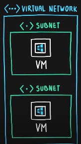

# Azure Architectural Components

## Geographies, Regions and Availability Zones

Terms: **Azure Geography**, **Region Pair**, **Azure Region**, **Azure Availability Zone**, **Data Center**

Azure runs in **data centers**, which contain servers and networking components. A data center has its own power, cooling and networking.

Related data centers are grouped into **regions**, a geographical area containing one or more data centers.

When creating a service, need to **choose a region**. Factors guiding a region choice:

- **Performance** - sending data around the world is slow
- **Availability** of services (not all available in all regions), or within a service the levels available (like which types of VMs in Azure VM)
- Regulatory and **compliance**

An **Availability Zone** is a regional feature (within a region) to protect against data center failures. Each AZ in a region has a different number (e.g. AZ #1) and each AZ contains **one or more data centers**.

Not all regions support availability zones, but if they exist there are **3 or more** availability zones present. There are two kinds of services:

1. **Zonal services** can be manually deployed to a specific Availability Zone (for example, VMs)
2. **Zone Redundant Services** that can automatically replicate across AZs (for example SQL Database), without needing to specify an availability zone to use. 

**Region pairs** are groups of regions within a single geography. Region pairs allow replication and failover in case of a natural disaster. **Each region must have one (1) region paired** with it, separated by 300 miles. You can't choose which region pair to pick - Microsoft does it. Updates are planned across region pairs to ensure nothing goes wrong.

**Geographies** are typically a country or group of countries; each geography has two or more regions. Data can move between regions in a geography for redundancy purposes - geographies are **fault tolerant**.

## Resource Groups and Azure Resource Manager

Azure has a hierarchical structure consisting of: **Management Groups**, **Subscriptions**, **Resource Groups** and **Resources**.

A **resource** is a manageable item in Azure, represented as a JSON definition, used to manage services. Represents the service lifecycle.

A **resource group** is a grouping of logically related resources. A resource group is itself also a resource (ie. it has a location as well)! It can group by type, **application lifecycle** (app and environment), department, or billing.

A resource must be in one resource group at a time, but one resource group can contain many resources each from many locations. Resources can be moved between resource groups. Resource groups cannot be nested. Deleting a resource group deletes all resources within it.

A **subscription** groups together user accounts into teams, allowing organizations to apply quotas and manage cost (department-level). A subscription can have boundaries (**billing boundary** and **access control boundary** for controlling cost and control access, respectively.

A **management Group** allows managing access, policy and compliance across multiple subscriptions (company-level). There may be a management group WITHIN a management group for more flexibility in organization. A management group can have multiple children, but only one parent and **6 levels of depth**.

The **Azure Resource Manager** is a central management and access layer for all Azure services. Authentication is done using **Azure Active Directory**. ARM then talks to resource services (database, VM, etc.). Interact with ARM in five ways:

1. **Azure Portal** (the web view), but this has an online Azure CLI built in
2. **Azure PowerShell** - a set of PowerShell cmdlets
3. **Azure CLI** - from the command prompt
4. **Azure Cloud Shell** - a shell in the cloud
5. **SDKs** (Python, Go, Ruby, Java, etc.)
6. **Azure Resource Manager REST API**

# Core Products in Azure

## Compute

Azure Compute is a set of services for on-demand, pay-per-use computations. Azure has **Virtual Machines**, **VM Scale Sets**, **App Service**, **Functions**, **Azure Container Instance** and **Azure Kubernetes Service**.

**Azure Virtual Machines** is an IaaS service that provides full control over the OS, but requires updating and installing software. Uses **virtualization**, which emulates physical hardware and allows multiple OSes to run on one machine.
An image must be given for the VM. Microsoft Marketplace offers a bunch of images that come with software preinstalled (things like SQL, Visual Studio, ArcGIS, etc.).

A **Virtual Machine Scale Set** is an IaaS service that will create identical VMs that auto-scale and provide redundancy.

Unlike VMs which have a host OS, **containers** virtualize the OS (such as Docker) making them lightweight. VMs emulate the operating system.

> VMs virtualize the hardware and containers virtualize the OS.

**Azure Container Instances** is a PaaS offering for easy deployment for simple containers, with limited control over orchestration, security, insight, etc. **Azure Container Registry** is a listing of container images  akin to DockerHub.

**Azure Kubernetes Service** is a PaaS, managed offering for container orchestration. Highly scalable and customizable and allows scaling for bigger apps. **Pods** are a group of containers sharing resources. **Nodes** are virtual machines (host) for the pods. Azure Kubernetes Service can work with **VM Scale Sets** to auto scale the underlying VMs, as well.

**App Service** (also called **Web App**) is a simplified PaaS for hosting an app - webapp, mobile or backend. It takes in a package or image, and deals with hosting, security and OS.
Originally called **Azure Websites**, requires an **App Service Plan**, which defines the pricing tier of underlying VMs.
Adds features - env vars, auth, state management, deployment slots (for dev and prod types), zip Uploader for files, container hosting and console access for underlying VM.

**Server-less apps** are even simpler - really have no concept of underlying VMs. Three types:

- **Azure Functions** - trigger-activated and fully managed, these run code on demand. They auto-scale and are best for short compute tasks
- **Azure Logic Apps** - design workflows. Logic Apps can call functions and other connectors. Logic Apps are stateful for the life of a request

**Summary**:

| Service                  | Control | Autoscale | Scalable? |
| ------------------------ | ------- | --------- | --------- |
| Virtual Machines         | ⭐⭐⭐⭐⭐   | No        | ⭐         |
| VM Scale Set             | ⭐⭐⭐⭐⭐   | Yes       | ⭐⭐⭐⭐⭐     |
| Container Instances      | ⭐⭐⭐     | No        | ⭐⭐        |
| Azure Kubernetes Service | ⭐⭐⭐⭐    | Yes       | ⭐⭐⭐⭐      |
| App Service              | ⭐⭐      | Yes       | ⭐⭐⭐       |
| Azure Functions          | ⭐       | Yes       | ⭐⭐⭐⭐      |

## Networking

Networking products allow creating secure networks for internal Azure resources, as well as hybrid cloud setups. 

**Azure Virtual Network** emulates networking, and links Azure services together. Resources can be VMs, Redis Cache, etc. and each has its own IP address.

Virtual networks can be isolated to secure them. A single Vnet can only exist in one region. They have **subnets** that contain an IP range to allow segmentation.

**Network Security Groups** allow restricting traffic from accessing a subnet.

**Virtual network peering** and **VPN Gateway** allows separate VNets to talk to one another, both within the cloud and from on-premises. **Virtual Network Gateway** (also called **Azure VPN Gateway**) can be of these types:

1. **Point to Site VPNs** - client computer connects to Azure securely
2. **Site to Site VPNs** - an on-premises device connects to Azure
3. **Azure ExpressRoute** (also site to site) - routes traffic thru third party providers and validates traffic between Azure and on-premises network. The key is that it is *completely private* but also unencrypted. Offers redundant connectivity.

For traffic distribution, there are two options:

1. **Azure Load Balancer** is a general/basic way to even out traffic distribution, and add high availability and scalability. You can have multiple load balancers (for example public and private for internal and external traffic). It supports TCP and UDP protocols.
2. **Azure Application Gateway** is a load balancer for HTTP traffic. Handles SSL encryption, firewall, session affinity (for routing requests to one server after initial session started), and routing.

 

**Content Delivery Network**
Azure CDN minimizes latency and offloads traffic from source servers (called **origin servers**). Typically for static data. **Edge Servers** are CDN servers that serve up data. Each type of content can be configured to have different expiry policy, etc.

## Storage Services

**Azure Storage Account** is a selection of storage services that are not SQL-based (consists of **File Storage**, **Disk Storage**, **Blob Storage**, **Table Storage** and **Queue Storage**). Data is stored three times fof redundancy. These are highly scalable and durable, and cheap.

There are three types of data:

1. **Structured / Relational data** - the schema is clearly defined
   Azure Storage account does not deal with structured data. Use Azure SQL Database / Azure Database for MySQL / Azure Database for PostgreSQL
2. **Unstructured Data** - no structure, like blob
   Azure Blob Storage, Azure File Storage, Azure Disk Storage
3. **Semi-Structured Data** - each row does not contain predefined columns; example NoSQL data or key/value pairs
   Cosmos DB, Azure Table Storage

**Blob** - **Binary Large Object** is any generic binary file and this can be stored by **Azure Blob Storage**.  **Block Blobs** store chunks for data like binary files. **Append Blocks** are good for logs and **Page Blobs** are good for frequent read/write ops. Three data **storage tiers**:

1. **Hot** - frequently accessed data
2. **Cool** - lower availability but high durability with lower cost
3. **Archive** - rarely accessed data

---

**Azure Queue Storage** is used for storing message queues, for asynchronous, event-based queues.

---

**Azure Table Storage** handles semi-structured tables for NoSQL databases.

---

**Azure File Storage** is designed for storing files. It is mountable as SMB. Good for apps that need file access from disk. Supports concurrent mounting by many clients.
Uses: lift and shift for on-premises network mounted storage, or extend on-premises mounts.

---

**Disk Storage** is IaaS persistent disk storage emulation used by virtual machines. It has type (SSD, HDD) along with sizes.

## Database Services

**Azure Cosmos DB** is globally distributed, millisecond-response time, multi-model database with a loosely typed schema (NoSQL). The database can read and write globally. Supports multiple APIs: SQL, MongoDB, Cassandra, Gremlin [graph database] and Table Storage APIs for querying. The model must be given at database creation time.

**Consistency Models** range from strong to eventual with three other levels. The different models trade off latency and/or availability. 

For relational data, there are three types:

1. Azure SQL Database
2. Azure SQL Managed Instance
3. Azure Database for MySQL (or PostgreSQL)
4. Azure SQL Data Warehouse

**Azure SQL Database** is the flagship PaaS (limited control of the underlying VM) offering:

-  Microsoft handles update, patch, backup, and infrastructure and runs Microsoft SQL Server
- Updates to MS SQL Server come to Azure SQL Database first
- Pricing is based on either cores of CPU or **DTU** (**Database Transaction Units**)

---

**Azure SQL Managed Instance** brings benefits of PaaS while adding more options for the underlying DB engine: character encoding, manual backups, cross-database views, etc.

More expensive than Azure SQL Database.

---

**Azure Database for MySQL** and PostgreSQL are cheaper offerings. Gives SQL Community Edition and pay-as-you-go pricing, with decent uptime, scalability and automatic backups.

PostgreSQL is available as **single server** and **hyperscale (Citus)**. Single server allows vertical scaling while hyperscale is a sharded option over multiple machines that distributes work automatically.

---

**SQL Data Warehouse** (**Synapse**) is a managed SQL offering for big data that allows parallel processing - this is Azure's equivalent for AWS Redshift.

---

**SQL VM** is the ability to install SQL on a VM as a complete IaaS offering, where you are fully responsible for everything.

**Azure Database Migration Service** migrates from on-premises or cloud databases into Azure. Databases can be assessed using a tool from Microsoft - **Data Migration Assistant** to determine if it is compatible with the target.

## Marketplace

**Azure Marketplace** has 8,000 templates for building solutions from both Microsoft and third parties Licensing costs are built into Azure Billing portal, so no need to buy licenses separately.

Examples: SQL, Oracle, WordPress or SAP.

**Microsoft App Source** is a related service that contains solutions for PowerBI, Dynamics 365 and Microsoft 365, but this is targeted to business users.