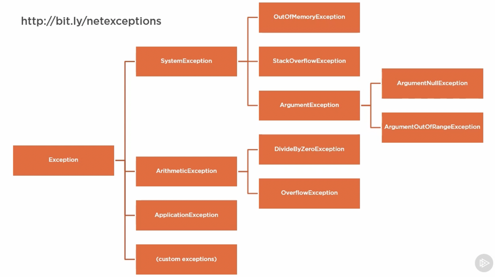

# Error Handling - Introduction

Excepts have an **exceptions hierarchy**, and when thrown have a **stack trace**. Exceptions can be **thrown**, **caught** and **rethrown**. Custom exceptions can be created as needed.

An **Exception** is an object that inherits from **System.Exception**. The `throw` statement can generate an exception. Exceptions can be custom or taken from .NET or a third party library.


# Exception Class Heirarchy

An Exception represents any unexpected behavior or error condition encountered by running program. **System.Exception** is the base exception class from which all exceptions inherit:



- **SystemException** is the child class of System.Exception, and has all the core built in exceptions: `StackOverflowException`, `ArgumentException`, `OutOfMemoryException`
- **ArithmeticException** also inherits from System.Exception and has all math-related exceptions - `DivideByZeroException` or `OverflowException`
- Custom exceptions also inherit from `System.Exception`.
- **ApplicationException** contains other exceptions


## System.Exception - the base class

Some properties available to `System.Exception`:

- `Message` - `string` describing reason for the exception for a developer. Should be user-friendly/
- `StackTrace` - `string` describing information about call stack
- `Data` - `IDictionary` with string keys and object values for additional information. Should not contain sensitive data
- `InnerException`- `System.Exception` captures preceding exception (for multiple **exception wrapping**)
- `Source` - `string` represents app/object that caused the error
- `HelpLink` - `string` link to URL for help file
- `TargetSite` - `System.Reflection.MethodBase` gives information about method that threw the error


To throw a generic exception there are three constructors:

```C#
throw new System.Exception();								// default message, no innerException
throw new System.Exception(string message); // message provided, no innerException
throw new System.Exception(string message, Exception innerException); // message and inner exception
```


## Exceptions to Throw

- `InvalidOperationException` - if property set or method call is invalid
- `ArgumentException` - generic exception for throwing when method argument is invalid
- `ArgumentNullException` - thrown when null passed to a non-null accepting method
- `ArgumentOutOfRangeException` - e.g. passing 0 for a divisor


## Exceptions Not to Throw

Do not throw these, as they are for runtime system use:

- `NullReferenceException` - thrown when deferencing null object
- `IndexOutOfRangeException` - when accessing an item in array that doesn't exist
- `StackOverflowException` - for infinite recursion
- `OutOfMemoryException`
- `ApplicationException` - also, custom exceptions should not derive from the `ApplicationException` base class. This class was originally intended for only the CLR, but has been used all over the place apparently.


# Catching, Throwing and Rethrowing Exceptions

## Throwing

To throw an exception, use the `throw` keyword:

```C#
public int Calculate(int num1, int num2, char operation)
{
  if (operation != '/')
  {
    // We use `nameof` so that if arg name changes, this will still be valid
    throw new ArgumentOutOfRangeException(nameof(operation), "operator not supported");
  }
}
```

Expressions can be thrown as of C#7.0, for example in a `??` operator:

```C#
public void Method(string op)
{
	string nonNullValue = someString ?? throw new ArgumentNotNullException(nameof(op));  
}
```

**Tips**

- Program flow should not be controlled by throwing exceptions (this is unlike Python)
- Never have empty catch blocks to swallow errors
- Use `TryParse` type methods with `out` parameters rather than throwing exceptions
- Return `null` for simple errors


## Catching

Catch blocks should be specified most specific to least specific.
C#6.0 allows adding filter conditions (using `when`) for filtering when specific catch blocks should be run (similar to `case` statements).

```C#
try
{
  // Some operation
}
catch (ArgumentNullException ex) when (ex.ParamName == "operationParam")
{
  // do something to handle specific exception
}
catch
{
  // handle all exceptions, without specifying type
}
finally
{
  // always execute
}
```


## Rethrowing

To rethrow, simply use the `throw` keyword **without** providing an exception variable. If you provide the variable, it will rethrow exactly that exception, thereby losing current stack trace:

```C#
try
{
  return Divide(num1, num2);
}
catch (DivideByZeroException ex)
{
  Log.Error(ex);
  throw;
}
```


**Rrethrowing with wrapping** allows re-throwing a caught exception while wrapping it. This allows, for example, changing exception type to make it more general.

```C#
try
{
  return Divide(num1, num2);
}
catch (DivideByZeroException ex)
{
	// Wrap the caught exception in another more general exception
  throw new ArithmeticException("Invalid divisor", ex);
}
```


To handle Global Errors for logging purposes, use `AppDomain`'s  unhandled exception event:

```C#
var currentAppDomain = AppDomain.CurrentDomain;
currentAppDomain.UnhandledException += myExceptionHandler;  // event receives sender and exception args
```


# Custom Exceptions

Custom exceptions should be created when they are different from .NET built in exceptions, or if you are building a library.

Exception names should end with `Exception`, extend `System.Exception`, and implement standard constructors (message, wrapper and no parameter constructor).

```C#
class CalculationException : System.Exception
{
  private static readonly string DefaultMessage = "Calc error occurred!";
  
  // Three constructors
  public CalculationException() : base(DefaultMessage) { }
  public CalculationException(string message) : base(message) {}
  public CalculationException(Exception innerException) : base(DefaultMessage, innerException) {}
}
```


# Unit Testing - xUnit

For xUnit unit testing against exceptions, create a project for testing and add `xunit` and `xunit.runner` from NuGet.

```C#
using Xunit;

namespace tests
{
  public class CalculatorShould
  {
    [Fact]
    public void ThrowsException()
    {
      var sut = new Calculator();
      var exc = Assert.Throws<CalcOperationException>(() => sut.Calculate(1, 1, "&")); // invalid operation
      Assert.Equal("+", exc.Operation);
    }
  }
}
```

