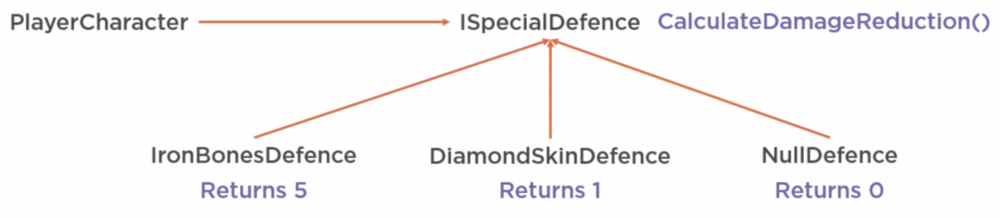

# Nullable Value Types

## Value vs. Reference Types

| Value Types                                | Reference Types                         |
| ------------------------------------------ | --------------------------------------- |
| Createed using `Struct`                    | Created using `Class`                   |
| Independent Instances                      | Each variable refers to shared instance |
| Changing value doesn't affect other copies | Changes affect all references           |
| The value **is** the information           | Points to reference                     |
| **Cannot be null**                         | **Is nullable**                         |
| No null checks needed                      | Need null checks                        |

- Remember C# passes parameters to function by value (which means a copy is passed; this does not relate to reference/value types).

- Strings are classes (reference types), whereas `int` and `DateTime` are not nullable as they are structs

  

## Making Value Types Nullable

Though value types are not nullable, they may NEED to be made nullable (e.g. a boolean that isn't defined). For this we have **Nullable< T >** type.

One way to make value types nullable, we can use magic numbers (not recommended approach), and add guards around code that uses those fields to check for the magic number.

To represent **nullable value types**, use the `System.Nullable<T>` struct - this basically has all values `T` has in addition to `null`. A shorthand for `Nullable<T>` is the `?`: `int?` or `DateTime?` is the same as `Nullable<int>` or `Nullable<DateTime>`. By default, `Nullable` enclosed types are set to `null`, so they don't need to be initialized to `null`

**Strings** are reference types (meaning they are nullable) and they can be empty also. The `String.IsNullOrEmpty` and `IsNullOrWhiteSpace` static methods help with checking nulls or white spaces.


# Accessing Nullable Values

`Nullable<T>` provides various methods:

- `.HasValue`	(whether underlying value is null; equivalent to `nullableValue != null`)
- `.Value` (gets underlying value - throws at runtime if value hasn't been set)
- `.GetValueOrDefault()` (get underlying value or default value)
- `.GetValueOrDefault(value)` (get underlying value or provided default value)

A nullable variable can be created from a non-nullable by implicit casting, but the reverse throws a compilation error. In that case, we can cast manually:

```C#
int i = 42;
int? j = i;		// this is OK as no data lost

int? a = 42;
int b = a;		// compilation error
int c = (int)a;
```


C# provides several null checking operators:

- `?` **conditional operator** (similar to JavaScript ternary operator)

  ```C#
  int i = nullableValue.HasValue ? nullableValue.Value : -1;
  ```

- `??` **null coalescing operator** (similar to JavaScript `||` shortcut operator)

  ```C#
  int i = nullableValue ?? -1;
  ```

- `?.` or `?` **null conditional operator** (optional chaining operator)
  This evaluates to null if the playerCharacter is `null`.

  ```C#
  int? days = playerCharacter?.DaysSinceLastLogin;
  // or
  int days2 = playerCharacter?.DaysSinceLastLogin ?? -1;
  ```

  For arrays, we can use the `?` operator to guard against the entire array being `null`. If array is defined but given index is out of bounds, you will still get an error.

  ```C#
  PlayerCharacter[] pca = null;
  string p1 = pca?[1]?.Name;
  ```


# Null Object Pattern and Null Reference Exceptions

The **Null Object Pattern** reduces null checks in the client code. This reduces run time **null reference excetpions** and checks.

The null object uses the same abstraction as the real class, except the null object *does* nothing.



We can further refactor this:

1. Make ISpecialDefence an abstract class with abstract methods that child classes implement.
2. Use the Null Object a private class within the SpecialDefence abstract class, and have a public field/getter for it to make it a singleton.

It's a bad idea to use null objects to hide exceptions (e.g if you can't access the database, don't return a null object, instead throw the error which has a stack trace).


# Non Nullable Reference Types

C# 8.0 added more features for nulls, such as the ability for reference types to be marked non nullable. Before C#8.0, all reference types were assignable as null, and you had to add null checks to **dereference** them. With C#8.0, we can specify reference types as **non-nullable**, meaning no null checks are needed and `null` cannot be assigned to them. All this is enforced by the compiler and output warning or errors - this is done on an opt-in basis.

To opt in, there are three options all of which mean that the variables cannot be `null`:

1. surround code with `#nullable enable`

   ```c#
   #nullable enable
   string message = null;
   #nullable disable
   ```

2. at the top of the file to make it apply to the entire file.

3. In the `.csproject` file to make it apply to the whole project `<Nullable>enable</Nullable>`


When opted in, we can must mark specific nullable variables with a `?`:

```C#
#nullable enable
string? message = null; // no error/warning
```


C#8 adds a **Null Forgiving Operator** (Typescript's `!` bang operator) in cases where the compiler is wrong in guessing null reference checks. This could be, for example, if a property is set using `Reflection` rather than directly. Uses:

- Unit tests
- Setting properties using reflection


For constraining generics, we can use the `where` operator:

```C#
public static void LogNullable<T>(T value) where T : class?
{
  // value will be something that extends class
  // i.e. an object or null, but not e.g. `DateTime?` as that is struct
}

public static void LogNonNullable<T>(T value) where T : class
{
  // now, value will be concrete - cannot be null
}
```


